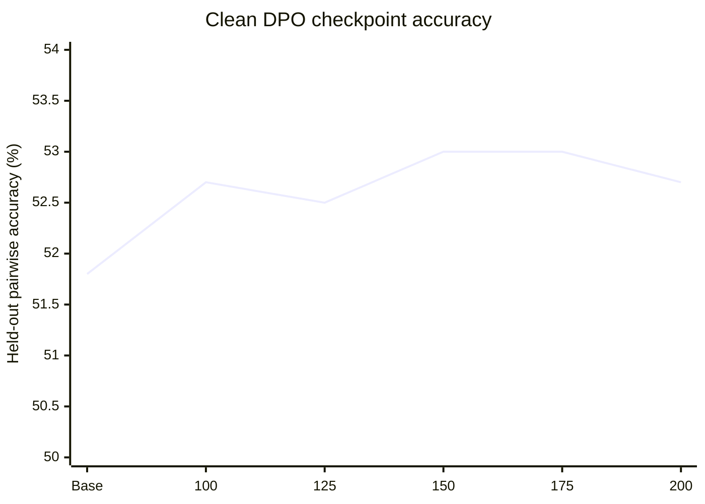
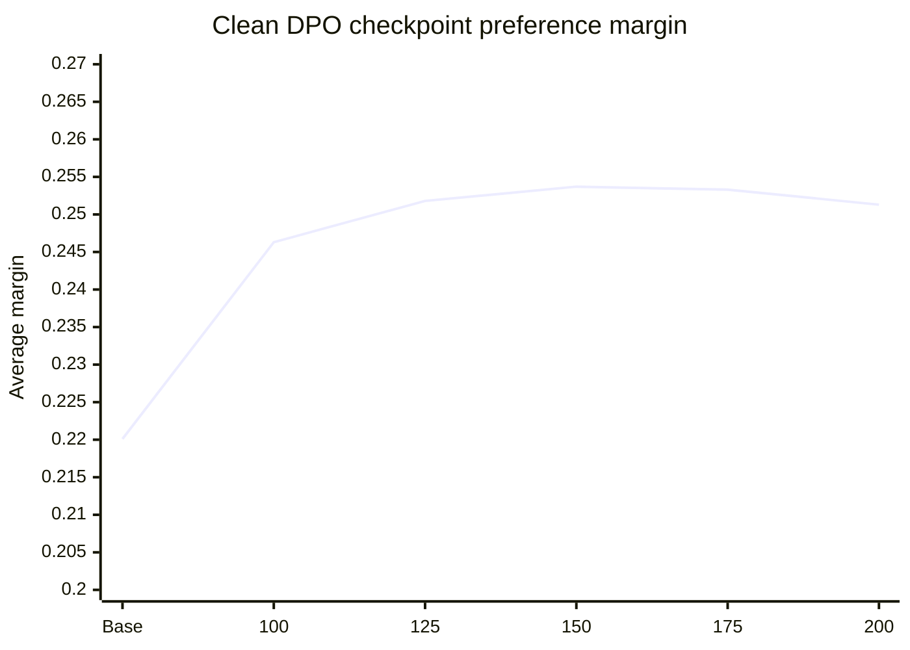

# DPO Under Noisy Preference Labels

## Question

How does randomly flipping a fraction of preference labels affect Direct Preference Optimization (DPO) on a small instruction-tuned language model?

The original motivation was simple: DPO receives pairs of answers where one is marked preferred. If some labels are incorrect, does the trained model degrade gradually, sharply, or barely at all?

This was a controlled reproduction-style experiment, not a claim of a new DPO result. Random-label noise has already been studied, including in [Provably Robust DPO](https://arxiv.org/abs/2403.00409).

## Setup

| Component | Choice |
|---|---|
| Starting model | `google/gemma-3-270m-it` |
| Why instruction-tuned | The raw Gemma base model repeated prompts instead of reliably answering them. Starting from the instruction-tuned checkpoint avoids confounding preference learning with basic chat formatting and instruction-following. |
| Training data | First 2,000 examples of `HuggingFaceH4/ultrafeedback_binarized`, `train_prefs` split |
| Test data | First 500 examples of the dataset's `test_prefs` split |
| Tie handling | Removed pairs where `score_chosen == score_rejected` because their preference labels are ambiguous for this experiment. |
| Clean training pairs | 1,753 |
| Clean test pairs | 440 |
| Noise mechanism | Randomly swap `chosen` and `rejected`; answer text is never edited. |
| Random seed | 42 |
| DPO steps | 200 optimizer steps for every noise condition |
| Batch setup | Per-device batch size 2, gradient accumulation 8, effective batch size 16 |
| Learning rate | `5e-6` |
| DPO beta | `0.1` |
| Maximum sequence length | 512 tokens |

The 10%, 30%, and 50% datasets were saved with their exact flipped indices and metadata on RunPod. This makes the corruption reproducible rather than merely reproducible in expectation.

## Evaluation

For every clean held-out pair, the model is given the prompt and scored on both answers. We compute the mean log-probability of the answer tokens rather than total log-probability, so long answers are not automatically penalized simply for containing more tokens.

For each pair:

```text
margin = mean_logprob(chosen answer) - mean_logprob(rejected answer)
```

We report two metrics:

| Metric | Meaning | Limitation |
|---|---|---|
| Pairwise accuracy | Fraction of pairs where the held-out `chosen` answer has higher score than `rejected`. | Binary. A tiny and a huge preference both count as one win. It measures agreement with UltraFeedback labels, not factual correctness. |
| Average preference margin | Mean difference between chosen and rejected answer scores. | Still a model-likelihood measure, not a direct human quality score. |

The test labels are not human ground truth. UltraFeedback preferences were largely generated by an evaluator model, and selected answers can be imperfect or factually wrong.

## Dataset Audit

| Split | Input pairs | Tied pairs | Tie rate | Mean score gap |
|---|---:|---:|---:|---:|
| Training | 2,000 | 247 | 12.35% | 1.883 |
| Test | 500 | 60 | 12.00% | 1.855 |

All original pairs satisfied `score_chosen >= score_rejected`. Ties were removed before both DPO training and held-out evaluation.

## Clean DPO Learning Curve

The unchanged Gemma IT checkpoint was evaluated first, then clean DPO checkpoints were evaluated against the same 440 held-out pairs.

| Checkpoint | Pairwise accuracy | Average margin |
|---|---:|---:|
| Base, no DPO | 51.8% | 0.2201 |
| Clean DPO, step 100 | 52.7% | 0.2463 |
| Clean DPO, step 125 | 52.5% | 0.2518 |
| Clean DPO, step 150 | 53.0% | 0.2537 |
| Clean DPO, step 175 | 53.0% | 0.2533 |
| Clean DPO, step 200 | 52.7% | 0.2513 |





Training loss declined from roughly 0.66 early in training to roughly 0.51 near step 200. Held-out accuracy, however, changed by only a few pairs. The best observed checkpoint was around steps 150 to 175, but choosing it after looking at held-out results would leak test-set information. The official clean control therefore remains the fixed 200-step run used for every noise condition.

## Noise Results

Each noisy condition starts from the same untouched Gemma IT checkpoint and uses 200 DPO steps. The test set remains clean in every condition.

| Training noise | Flipped labels | Pairwise accuracy | Change from clean DPO | Average margin | Change from clean DPO |
|---:|---:|---:|---:|---:|---:|
| 0% | 0 | 52.7% | - | 0.2513 | - |
| 10% | 175 | 52.5% | -0.2 points | 0.2424 | -0.0089 |
| 30% | 526 | 52.0% | -0.7 points | 0.2349 | -0.0164 |
| 50% | 876 | 52.3% | -0.4 points | 0.2257 | -0.0256 |

```mermaid
xychart-beta
    title "Held-out accuracy by training-label noise"
    x-axis [0%, 10%, 30%, 50%]
    y-axis "Pairwise accuracy (%)" 50 --> 54
    line [52.7, 52.5, 52.0, 52.3]
```

```mermaid
xychart-beta
    title "Held-out preference margin by training-label noise"
    x-axis [0%, 10%, 30%, 50%]
    y-axis "Average margin" 0.20 --> 0.27
    line [0.2513, 0.2424, 0.2349, 0.2257]
```

### Immediate Reading

The average preference margin falls monotonically as label noise rises. This is the clearest signal in the experiment.

Pairwise accuracy does not fall monotonically. The 50% condition scores slightly above the 30% condition, despite having a lower average margin. This is not evidence that 50% noise improves DPO. It shows that the binary accuracy metric is noisy at this scale.

## Why We Stopped

We stopped this branch after 0%, 10%, 30%, and 50% noise rather than training longer or adding a 100% condition.

1. Training longer was not helping the held-out metric. Clean DPO accuracy was 52.7% at both 100 and 200 steps, while training loss kept decreasing. This is consistent with fitting the training preferences without substantial held-out improvement.
2. The measured accuracy effects are small. On 440 pairs, one pair changes accuracy by about 0.23 percentage points. The largest clean-versus-noisy difference was only about three pairs.
3. A rough binomial standard error near 52% accuracy on 440 pairs is about 2.4 percentage points. This calculation is only a heuristic because pairs are not guaranteed independent, but it makes the main point: differences below one percentage point cannot support a strong conclusion from one run.
4. Only one random seed was used. The experiment cannot distinguish a real small effect from seed-specific training or sampling variation.
5. Random label flips are already a well-studied noise model. Extending this exact sweep would improve a reproduction, but is unlikely to become an interesting standalone project without a stronger evaluation or a comparison to robust DPO.
6. The benchmark measures agreement with synthetic UltraFeedback preferences, not direct factuality, usefulness, or safety. More training would not fix that interpretability problem.

This is not a code failure. All conditions trained successfully, saved checkpoints, and completed evaluation. It is a decision to avoid over-interpreting a small effect and to avoid spending more compute on a weakly diagnostic setup.

## What This Experiment Shows

The narrow conclusion supported by this run is:

> With Gemma 3 270M IT, 1,753 filtered UltraFeedback pairs, and 200 DPO steps, increasing random preference-label noise consistently reduced the average held-out preference margin. The corresponding pairwise-accuracy differences were too small and variable to establish a reliable accuracy trend from one seed.

## What It Does Not Show

- It does not show that DPO is generally robust to 50% noise.
- It does not show that noisy DPO preserves factual accuracy or helpfulness.
- It does not compare vanilla DPO to robust DPO, SFT, PPO, or another preference-optimization method.
- It does not establish causal behavior changes in generated responses.
- It does not support a claim about human preferences, because UltraFeedback labels are not a human gold standard.

## Saved Artifacts

RunPod artifacts are stored under:

```text
/workspace/dpo-preference-noise/artifacts/
```

Each noise directory contains:

```text
dataset/                 Exact saved corrupted DPO dataset
dataset_metadata.json    Source dataset, seed, noise rate, and flipped indices
checkpoints/             Retained checkpoints at steps 100, 125, 150, 175, 200
model/                   Final 200-step model and tokenizer
evaluation.json          Clean held-out evaluation result
```

## Next Decision

Do not add more random-noise conditions by default. There are two defensible follow-ups:

1. Replicate 0%, 30%, and 50% with two more seeds and report uncertainty.
2. Pivot to a controlled LLM-judge audit where correctness is known independently, such as whether verbosity, confidence, or fake-looking evidence causes a judge to prefer a worse answer.

The second option is more likely to create a clear and interesting next project.
