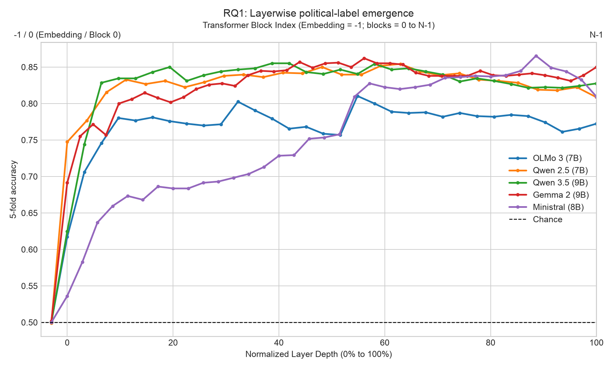
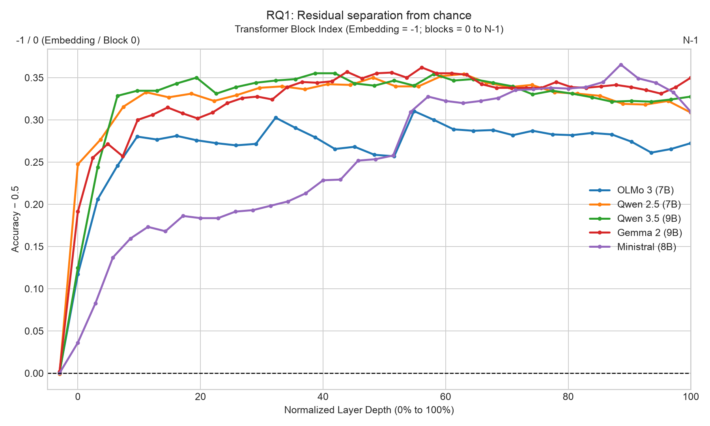

# RQ1 Findings: Layerwise Political-Label Emergence

Last updated: 2026-08-19

## Status

The initial Qwen 3.5 (9B) run failed during the Hugging Face download because the VM ran out of disk space. After the cache was cleared, the rerun completed and produced a verified probe artifact. The comparison below contains all five models.

## Method

For each suitable declarative policy statement, the run extracted the final-token hidden state from every available transformer layer. A logistic-regression probe was trained separately at each layer to predict the statement's binary polarity. Evaluation used five-fold grouped cross-validation, with question ID as the group, so paired statements from one question did not cross the train/test boundary. The main metric is mean held-out accuracy; the JSONL files also record F1.

## Model summary

| Model | Total blocks | Embedding | Peak layer | Peak accuracy | Peak F1 | Final block | Relative peak depth |
|---|---:|---:|---:|---:|---:|---:|---:|
| OLMo 3 (7B) | 32 | 50.09% | Block 17 | 81.03% | 0.8086 | 77.24% | 54.8% (17 / 31) |
| Qwen 2.5 (7B) | 28 | 49.91% | Block 17 | 85.43% | 0.8535 | 80.86% | 63.0% (17 / 27) |
| Qwen 3.5 (9B) | 32 | 50.00% | Blocks 12–13 | 85.52% | 0.8549 | 82.76% | 38.7–41.9% (12–13 / 31) |
| Gemma 2 (9B) | 42 | 50.17% | Block 23 | 86.21% | 0.8629 | 85.00% | 56.1% (23 / 41) |
| Ministral (8B) | 36 | 50.00% | Block 31 | 86.55% | 0.8680 | 80.95% | 88.6% (31 / 35) |

## Plots

## Findings

### Relative peak depth

OLMo 3 peaks at Block 17, Qwen 2.5 peaks at Block 17, Qwen 3.5 has a tied peak at Blocks 12–13, Gemma 2 peaks at Block 23, and Ministral peaks at Block 31. Qwen 3.5's tied peak is 85.52% accuracy and 0.8549 F1. Using `peak_block / (total_blocks - 1) * 100%`, these are approximately 54.84% (17 / 31 * 100%), 62.96% (17 / 27 * 100%), 38.71–41.94% (12–13 / 31 * 100%), 56.10% (23 / 41 * 100%), and 88.57% (31 / 35 * 100%), respectively. OLMo 3, Qwen 2.5, Qwen 3.5, and Gemma 2 peak in the middle portion of the network, while Ministral's peak occurs later. The models have different depths and architectures, so these normalized positions are descriptive rather than a controlled estimate of a universal emergence layer.

### Emergence curve

All five completed models are near or above chance at the first measured blocks, so the result does not show a sharp onset from an uninformative baseline. Instead, accuracy generally rises through the early and middle layers, reaches a model-specific maximum, and then changes direction or levels off. This is consistent with political polarity being increasingly readable in the residual stream, but it does not establish when the representation was first formed or whether the probes exploit lexical or topic-related cues.

### Final-layer drops

The final layer is below the peak for every completed model. The drop is smallest for Gemma 2 (0.012 accuracy points), followed by Qwen 3.5 (0.028), OLMo 3 (0.038), Qwen 2.5 (0.046), and Ministral (0.056). Thus, the last layer is not uniformly the best probing location. The drop is measured relative to each model's own peak and should not be interpreted as evidence that later layers erase political information: the probe, token pooling choice, dataset, and model-specific layer count all affect this curve.

## Limitations and next step

This is a single pooled probe per layer, not a per-language emergence analysis, despite the broader RQ1 plan. The labels come from the curated declarative-statement dataset, and no topic, sentiment, lexical, or country-entity control is included here. The Qwen 3.5 rerun completed after clearing the cache; its JSONL contains 38,280 records across the embedding layer and Blocks 0–31.
